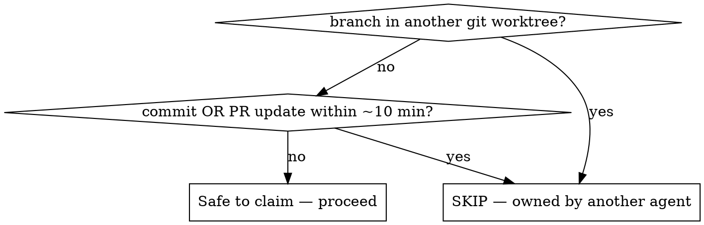

# Fixing and Merging PRs

## Overview

Finalize each open PR: take it from red CI to **merged**, looping review→fix until clean, without stepping on another agent who is also working it. **The non-obvious failure mode is collision, not the fix itself:** in a repo with a multi-agent fleet, nearly every open PR can be actively owned, and picking by commit-recency alone will make you race someone — duplicate work, rejected pushes, conflicting commits.

**Core principle: prove the PR is unowned BEFORE you touch it, re-prove it BEFORE you push, and stand down rather than race.**

**Merge authorization:** invoking this skill *is* the user's authorization to auto-merge. A PR merges automatically once it is **(a) unowned, (b) all required checks green, and (c) every review finding addressed** — all three. This is the named exception to the usual "ask before merging" default; it applies only to PRs that pass the ownership gate.

## The Loop

Sweep all open PRs oldest-first. For each one, run this loop to completion before moving to the next:

1. **List candidates oldest-first.** `gh pr list --state open --json number,title,headRefName,createdAt,isDraft,author` → sort by `createdAt`.
2. **Ownership check (gate — see below).** Skip any PR with active agent work. If *all* are owned, **stand down and report** — do not pick "the least active."
3. **Diagnose CI.** Pull the failing job logs; find the root cause.
4. **Fix at the source.** Prefer fixing the generator/config/code that produces the failure over patching its output.
5. **Verify locally** with the *exact* command CI runs, before pushing.
6. **Re-verify ownership, then push** (step 2 again — agents resume).
7. **Claude-review loop.** Wait for the `claude-review` check + bot comments; address every finding (fix or explicitly justify); push; repeat until the check is green and **no** unaddressed findings remain.
8. **Auto-merge.** Confirm the PR is still unowned, **every** required check is green (`gh pr checks <n>` — not just `claude-review`), and no findings are open. Then merge: `gh pr merge <n> --squash --delete-branch`. Use `--auto` instead if you want GitHub to gate the merge on required checks itself. Do **not** merge if any of the three conditions fails — re-enter the loop or stand down.
9. **Next PR.** Move to the next oldest unowned PR and repeat from step 2 until the open queue is empty or every remaining PR is owned.

## Ownership Check — the gate that prevents collisions



**Run BOTH signals — commit-recency alone is insufficient:**

```bash
git worktree list                                  # branch in another worktree = OWNED, do not touch
git fetch origin <branch> && git log --oneline origin/<branch>~3..origin/<branch>
gh pr view <n> --json updatedAt,commits
```

- A branch checked out in **another worktree** (`.worktrees/*`, `.claude/worktrees/*`, `conductor/*`, `.grok/*`) is agent-owned and **locked** — you often can't even `git checkout` it. Treat as owned regardless of how old its last commit is (an agent can think/edit for >10 min without committing).
- **Re-check immediately before pushing.** An idle PR can get a fresh push minutes into your work; if so, your push is rejected — back off, don't `--force`.

## Diagnosing & fixing CI

```bash
gh pr checks <n> --json name,state,link --jq '.[]|select(.state|test("FAIL|ERROR"))|"\(.name) \(.link)"'
gh run view --job <job-id> --log-failed | tail -60
```

- **Fix at the source.** If a code generator emits lint-violating output, fix the generator and regenerate so *every* future output is clean — don't hand-edit the generated file (it'll regress, and a `--check` step will flag the drift).
- **Reproduce the failure locally with the exact CI command** (e.g. run the pinned linter `npx @biomejs/biome@<version> check ...`, the repo's `make`/script target, or the tech-debt/contract checker) and confirm it passes before pushing. Reading the rule isn't verifying the fix.
- Honor any **generated-artifact contract**: if CI runs `<tool> --check`, your committed output must be byte-identical to freshly generated output.

## Claude-review loop

The `claude-review` check posts findings as PR comments (author = the review bot, e.g. `claude`). After each push: wait for it to finish, read every finding, fix or explicitly justify each, push, and loop until the check is green and no unaddressed findings remain.

## Red Flags — STOP

- "Its last commit is 15 min old, so it's free" → **you didn't run `git worktree list`.**
- "Another agent pushed to my branch, but I'll just `--force`/rebase over it" → **you're racing. Back off.**
- "All PRs are owned, but I'll take the least-busy one anyway" → **stand down and report instead.**
- "I'll fix the generated file directly" → **fix the generator; the file regenerates.**
- "biome/ruff/the rule looks satisfied" → **run the exact CI command; don't eyeball it.**
- "claude-review is green, so I'll merge" → **check ALL required checks (`gh pr checks`), not just the review bot.**
- "There's one open finding but it's minor, I'll merge anyway" → **no. Every finding addressed first, or don't merge.**
- Auto-merging a PR that's owned by another agent → **the merge gate requires unowned. Re-check ownership at step 8.**

## Common Mistakes

| Mistake | Reality |
|---|---|
| Pick PR by commit time only | Misses agent-owned worktrees that haven't committed recently. Run `git worktree list`. |
| Push without re-checking ownership | Agents resume; you get a rejected/conflicting push. Re-check right before push. |
| Patch the generated output | A `--check` step flags drift; next regen reverts you. Fix the source. |
| Eyeball the lint fix | Style rules (quote style, `useLiteralKeys`, semicolons) are exact. Run the pinned tool. |
| Merge on a green review bot alone | `claude-review` green ≠ CI green. Gate on ALL required checks via `gh pr checks`. |
| Merge an owned PR because it's green | The auto-merge gate requires unowned. Re-check `git worktree list` at step 8. |

## When to stand down vs. ask

- **Stand down + report** when every open PR is owned (the task's premise — idle PRs exist — is false). Auto-merge does **not** override the ownership gate.
- **Ask** only when ownership is genuinely ambiguous (offer: stand down / finalize a specific named PR / pause an agent's worktree first). A clean, unowned, green PR needs no ask — invoking this skill already authorized the merge.

---

_Original skill by Kevin — vendored from a personal skills collection._
